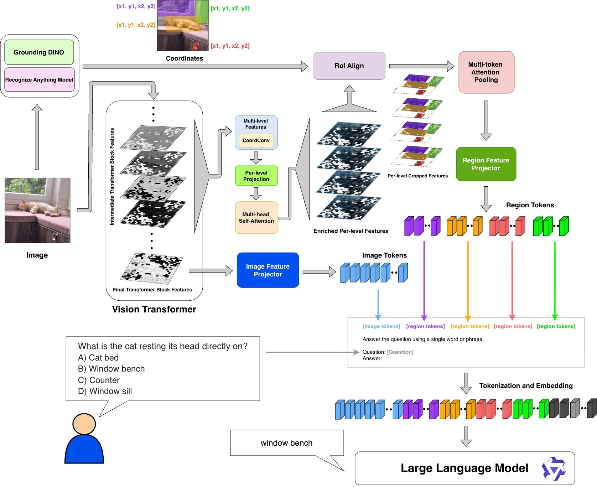
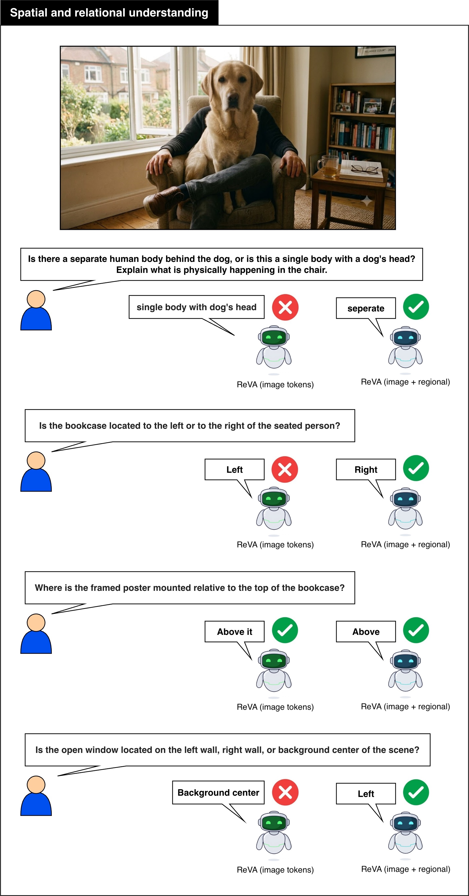
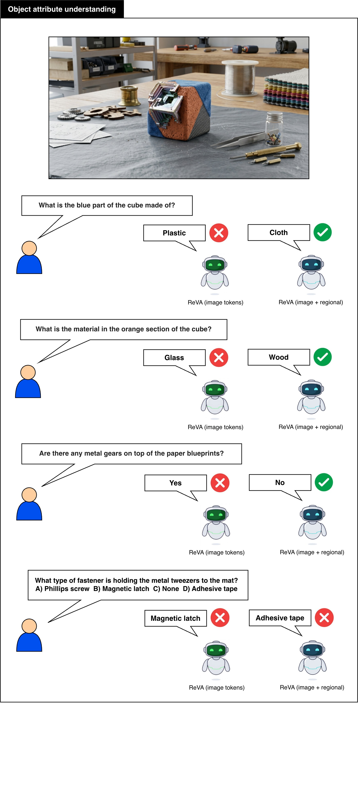
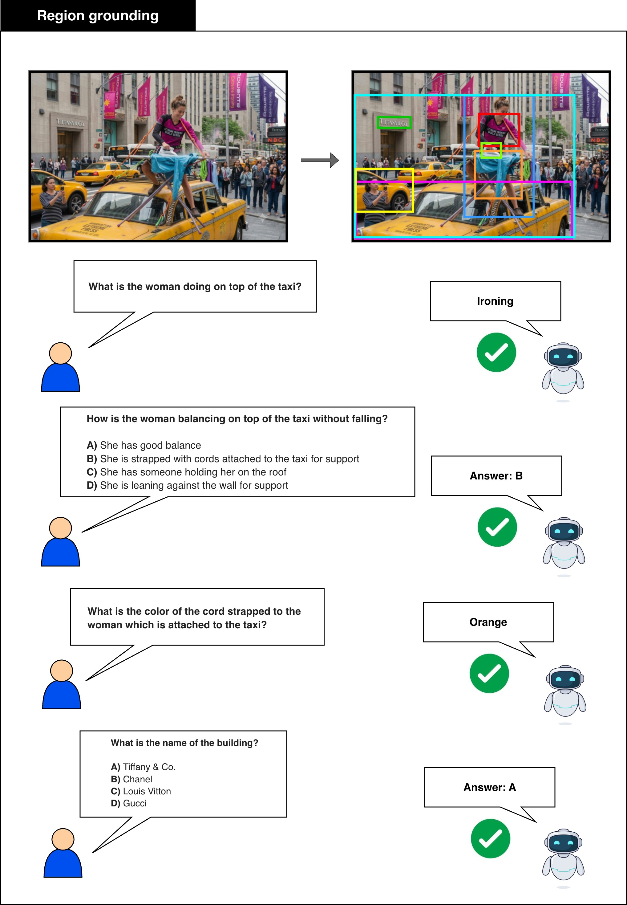
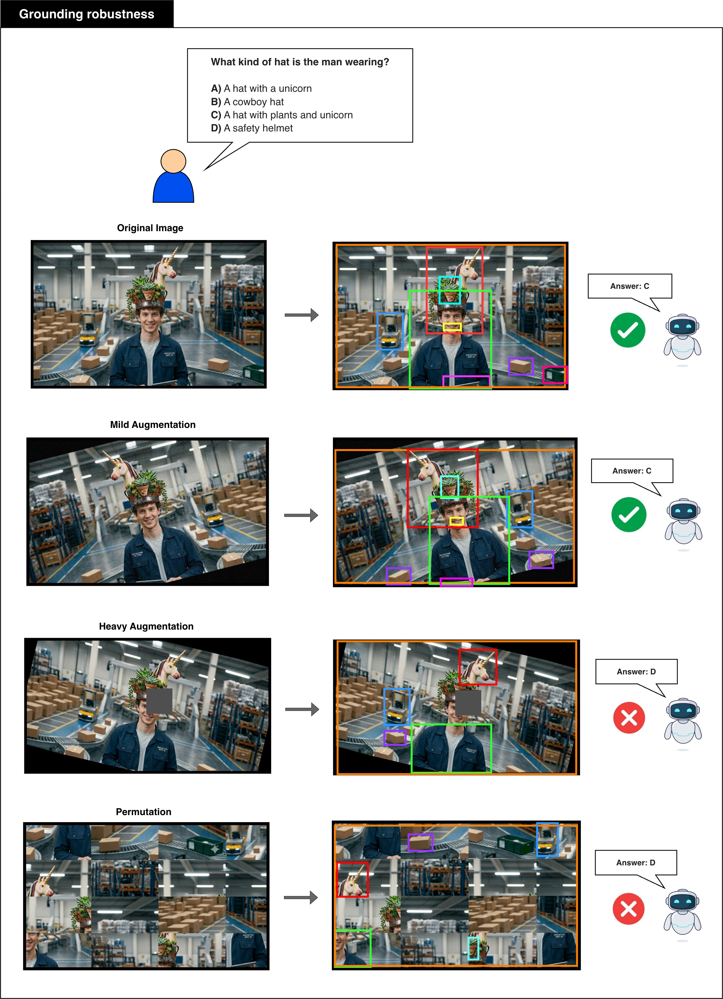

# ReVA

ReVA, short for **Region-Aware Visual Assistant**, is a visually grounded
question answering system designed to improve spatial reasoning and reduce
object-level hallucination in multimodal large language models.

The system combines a frozen `CLIP ViT-L/14` visual encoder with
`Qwen2.5-7B-Instruct` through two learned projection bridges:

- a **global bridge** that converts final-layer CLIP patch features into
  576 global visual tokens
- a **region bridge** that converts localized RoI-aligned multi-level visual
  features into compact region tokens

At inference time, ReVA pairs global scene context with localized evidence from
boxes proposed by `RAM++` and `Grounding DINO`, then feeds the combined visual
prefix into Qwen for answer generation. Training is split into three stages:

1. global image-text alignment
2. region-description alignment
3. LoRA fine-tuning for grounded VQA

This repository provides the research code for training, evaluation, and final
system inference, together with curated notebooks for the primary workflows
and archived notebooks for supplementary analysis.

## Visual Overview

Architecture overview:



## Contents

- [Repository Layout](#repository-layout)
- [Environment Setup](#environment-setup)
- [Compute Requirements](#compute-requirements)
- [Model Sizes](#model-sizes)
- [Required Weights](#required-weights)
- [Data Layout](#data-layout)
- [Training](#training)
- [Inference](#inference)
- [Evaluation](#evaluation)
- [Qualitative Examples](#qualitative-examples)
- [Acknowledgements](#acknowledgements)

## Repository Layout

Key files and directories:

- `reva/`: package containing the core Python modules for configuration,
  model loading, datasets, training, inference, and evaluation
- `scripts/`: curated public notebook subset for training, inference, and
  official evaluation workflows
- `scripts/archive/`: additional research, benchmark-specific decontamination,
  and exploratory notebooks kept for reference

## Environment Setup

Create a Python environment and install the dependencies:

```bash
source "$(conda info --base)/etc/profile.d/conda.sh"
conda create -n reva python=3.10 -y
conda activate reva
conda install -n reva pytorch torchvision torchaudio pytorch-cuda=12.1 -c pytorch -c nvidia -y
pip install -r requirements.txt
python -m spacy download en_core_web_sm
```

Notes:

- `torch`, `torchvision`, and `torchaudio` are intentionally installed with
  Conda because GPU/CUDA compatibility matters for this project.
- The pinned `huggingface-hub` and `peft` versions in `requirements.txt` are
  intentional; newer Hub releases and older PEFT releases were incompatible
  with the released inference stack during JupyterHub validation.
- If you use the decontamination pipeline on Linux with GPU FAISS support,
  follow the note in `requirements.txt` about `faiss-gpu-cu12`.

If you want to use the notebooks in Jupyter or JupyterHub, also install a
kernel for the environment:

```bash
pip install ipykernel
python -m ipykernel install --user --name reva --display-name "Python (reva)"
```

If a notebook still resolves to the wrong interpreter after that, remove the
old kernelspec and recreate it from the activated `reva` environment:

```bash
rm -rf ~/.local/share/jupyter/kernels/reva
python -m ipykernel install --user --name reva --display-name "Python (reva)"
```

Inside a notebook, you can confirm the selected kernel is correct with:

```python
import sys
print(sys.executable)
```

The notebook kernel should report the `reva` environment interpreter, for
example `/opt/conda/envs/reva/bin/python`.

## Compute Requirements

ReVA is a CUDA-oriented research codebase. In practice, a modern NVIDIA GPU is
recommended for both inference and training.

- **Inference:** an NVIDIA A40 is a practical target for running final ReVA
  inference. The Stage 3 pipeline combines Qwen2.5-7B-Instruct, CLIP ViT-L/14
  at 336 px, Projection-A, Projection-B, and optionally RAM++ plus Grounding
  DINO for automatic region proposals. CPU-only use is mainly suitable for
  debugging, not normal end-to-end inference.
- **Training:** reproducing the full training pipeline is substantially more
  demanding than running inference. NVIDIA A100-class GPUs are the recommended
  target for training either bridge and for the heavier paper-style workloads.
  Stage 1, Stage 2, and Stage 3 all assume GPU execution, and full
  reproduction should be treated as a multi-stage research workload rather than
  a lightweight finetuning script.
- **Paper reference:** the paper reports RAM++ and Grounding DINO proposal
  inference on NVIDIA A100 GPUs in bf16.
- **Storage:** full reproduction also requires significant local disk for
  checkpoints, caches, and benchmark image archives. Plan for many tens of GB
  rather than a minimal code-only setup.

If you only want to inspect the code or run lightweight checks, a smaller setup
is enough. If you want to reproduce the reported results, use a CUDA-capable
machine with substantial disk and memory headroom.

## Model Sizes

Approximate frozen backbone sizes and exact released projection/adapter sizes:

- `CLIP ViT-L/14-336`: about `304M` frozen parameters
- `Qwen2.5-7B-Instruct`: about `7.6B` frozen parameters
- `Projection-B`: `16,522,240` parameters
- `Projection-A / RegionFeatureExtractor`: `44,502,244` parameters
- Stage 1 LoRA adapter: `40,370,176` adapter parameters
- Stage 3 LoRA adapter: `40,370,176` adapter parameters

`Projection-A / RegionFeatureExtractor` breaks down as:

- encoder total: `8,439,876`
- attention pooling: `8,487,072`
- projection head A: `27,575,296`

Grounding DINO and RAM++ are external dependencies and are not currently listed
here with exact parameter counts.

## Required Weights

This repository does not ship model weights. Depending on the workflow you run,
you may need some or all of the following:

- frozen vision encoder weights from Hugging Face
- Qwen base model weights from Hugging Face
- `projection_b_best_weights.safetensors`
- `projection_a_curriculum_best_weights.safetensors`
- Stage 1 LoRA adapter weights
- Stage 3 LoRA adapter weights
- Grounding DINO weights:
  - `GroundingDINO_SwinT_OGC.py`
  - `groundingdino_swint_ogc.pth`
- RAM++ checkpoint:
  - `ram_plus_swin_large_14m.pth`

ReVA-specific released weights are hosted on Hugging Face:

- [https://huggingface.co/anoop675/reva-weights](https://huggingface.co/anoop675/reva-weights)

That repository currently contains:

- `projection_b_best_weights.safetensors`
- `projection_a_curriculum_best_weights.safetensors`
- `stage1_lora/`
- `stage3_lora/`

Base model weights such as `Qwen2.5-7B-Instruct` are not stored in this
repository. ReVA loads them from their original upstream Hugging Face source
and caches them locally on first use.

Best practice is to store these outside the Git repo and point the code to
their local paths via config values or script arguments.

## Data Layout

The code assumes local caches, datasets, checkpoints, and outputs live outside
the repository. A typical layout looks like:

```text
~/reva-data/
  hf_cache/
  checkpoints/
  eval_results/
  region_data/
  decontamination/
  groundingdino/
  vqav2/
  gqa/
  coco/
```

If you use a different directory structure, update the relevant paths in
`reva/config.py` and the notebook/script parameters.

The main code now supports environment-variable overrides for the common path
roots. Useful variables include:

```bash
export REVA_DATA_ROOT=/path/to/reva_data
export REVA_HF_CACHE_ROOT=/path/to/reva_data/hf_cache
export REVA_CHECKPOINT_ROOT=/path/to/reva_data/checkpoints
export REVA_EVAL_RESULTS_ROOT=/path/to/reva_data/eval_results
export REVA_REGION_DATA_ROOT=/path/to/reva_data/region_data
export REVA_DECONTAMINATION_ROOT=/path/to/reva_data/decontamination
export REVA_GROUNDING_DINO_ROOT=/path/to/reva_data/groundingdino
export REVA_VQAV2_ROOT=/path/to/reva_data/vqav2
export REVA_TEST_IMAGES_ROOT=/path/to/reva_test_images
```

If these are not set, the code falls back to user-relative defaults under
`~/reva-data`.

## Training

Training is notebook-first. The notebooks under `scripts/` correspond to the
intended end-to-end workflow, while the `reva/` package contains the reusable
training, dataset, inference, and evaluation code that those notebooks call.

### Recommended order

1. `scripts/stage1_global_alignment_training.ipynb`
2. `scripts/stage2_region_alignment_training.ipynb`
3. `scripts/stage3_decontamination.ipynb`
4. `scripts/stage1_global_lora_training.ipynb`
5. `scripts/stage3_concat576_lora_training.ipynb`

### Notebook roles

- `scripts/stage1_global_alignment_training.ipynb` trains `Projection-B`, the
  global bridge from frozen CLIP or DINOv2 patch features into Qwen embedding
  space, using the LLaVA pretraining-style image-caption alignment setup.
- `scripts/stage2_region_alignment_training.ipynb` trains `Projection-A` and
  the region bridge stack, aligning region-level visual features to text using
  RefCOCO, Visual Genome, COCO detections, and related regional supervision.
- `scripts/stage3_decontamination.ipynb` builds the Stage 3 clean training
  pool and removes benchmark overlap using hard-ID filtering and pHash-based
  checks before LoRA fine-tuning.
- `scripts/stage1_global_lora_training.ipynb` trains the official Stage 1
  baseline system: 576 global `Projection-B` tokens plus Qwen LoRA adapters,
  with no regional tokens at inference or training time.
- `scripts/stage3_concat576_lora_training.ipynb` trains the final Stage 3
  system: 576 global `Projection-B` tokens concatenated with `K x 16`
  `Projection-A` region tokens, followed by Qwen LoRA fine-tuning.

### Supporting modules

- Stage 1 alignment: `reva/training.py`, `reva/dataset.py`
- Stage 2 regional alignment: `reva/models.py`, `reva/training.py`,
  `reva/dataset.py`
- Stage 3 decontamination and LoRA: `reva/stage3_dataset.py`,
  `reva/stage3_train.py`, `reva/training.py`

Additional exploratory or benchmark-specific notebooks live under
`scripts/archive/`.

## Inference

The repository now includes a minimal module entrypoint for final ReVA inference:

```bash
python -m reva.run_inference \
  --image /path/to/image.jpg \
  --question "What is the person holding?" \
  --projection-b /path/to/projection_b_best_weights.safetensors \
  --projection-a /path/to/projection_a_curriculum_best_weights.safetensors \
  --lora /path/to/final_stage3_lora \
  --box-source hybrid
```

The projection loaders accept either legacy `.pt` checkpoints or `.safetensors`
files.

On the first run, the script may also download the base CLIP and
`Qwen2.5-7B-Instruct` weights into the configured Hugging Face cache. Expect
many gigabytes of downloads if those models are not already cached locally.

Typical inference setup requires:

- a base Qwen checkpoint
- projection weights
- a Stage 3 LoRA adapter directory
- `GroundingDINO_SwinT_OGC.py` and `groundingdino_swint_ogc.pth` in
  `REVA_GROUNDING_DINO_ROOT`
- `ram_plus_swin_large_14m.pth` in `REVA_GROUNDING_DINO_ROOT` when using
  `--box-source hybrid` or `--box-source ram`
- local image paths

## Evaluation

Benchmark evaluation helpers are implemented in `reva/evaluation.py`. The codebase
includes utilities for:

- GQA
- VQAv2
- POPE
- MMBench
- SEED-Bench image evaluation

Evaluation in the current repo is primarily notebook/Python-driven rather than
a single CLI command. The public-facing notebooks are kept in `scripts/`, while
older exploratory or benchmark-specific variants live in `scripts/archive/`.

For statistical comparison between two completed benchmark output directories:

```bash
python -m reva.significance_paired_ttest \
  --baseline /path/to/baseline_eval_dir \
  --final /path/to/final_eval_dir
```

This compares paired benchmark outputs such as POPE, MMBench, and SEED-Image
with both a paired t-test and a McNemar test, and optionally includes VQAv2 if
labeled JSONL predictions are available.

For the notebook workflow, use:

- `scripts/significance_test.ipynb`

That notebook bootstraps the repo root automatically, assumes no GPU, and is
intended for comparing Stage 1 (`global576_stage1`) against Stage 3
(`concat576_full_pipeline`) evaluation outputs at question level.

## Qualitative Examples

<table>
  <tr>
    <td width="50%" valign="top">
      
    </td>
    <td width="50%" valign="top">
      
    </td>
  </tr>
  <tr>
    <td width="50%" valign="top">
      
    </td>
    <td width="50%" valign="top">
      
    </td>
  </tr>
</table>

## Acknowledgements

This repository benefits from the open-source projects that informed and supported this work, including [QwenLM](https://github.com/QwenLM/Qwen2.5), [LLaVA](https://github.com/haotian-liu/LLaVA), [Shikra](https://github.com/shikras/shikra), [GPT4RoI](https://github.com/jshilong/GPT4RoI), [CLIP](https://github.com/openai/CLIP), [Grounding DINO](https://github.com/IDEA-Research/GroundingDINO), and [Recognize Anything (RAM++)](https://github.com/xinyu1205/recognize-anything). Special thanks go to [Prof. Shalom Lappin](https://gu-clasp.github.io/people/shalom-lappin/contact), the School of Electronic Engineering and Computer Science, and the comp-teach team at Queen Mary University of London.

